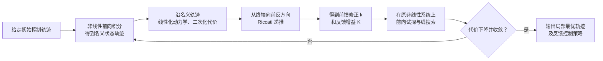

# LQ问题 Linear Quadratic（线性二次）最优控制问题：
- 系统动力学是线性的；
- 目标函数是状态和控制输入的二次函数。
它的重要性在于：这类问题可以通过动态规划和 Riccati 方程得到解析结构的最优反馈控制器。SLQ 中每次反向迭代，本质上就是在求解一个局部的、时变的 LQ 问题。

## 什么是 LQ 问题
先看离散时间有限时域问题：
$$x_{k+1} = A_k x_k + B_k u_k, \qquad k = 0, \dots, N-1.$$
其中：
* $x_k \in \mathbb{R}^n$: 状态；  
* $u_k \in \mathbb{R}^m$: 控制；  
* $A_k, B_k$: 线性系统矩阵。  
目标函数为
$$J = \frac{1}{2} x_N^\top Q_N x_N + \frac{1}{2} \sum_{k=0}^{N-1} \left( x_k^\top Q_k x_k + u_k^\top R_k u_k \right).$$
这里：  
* $x_k^\top Q_k x_k$: 状态偏离零点的代价；  
* $u_k^\top R_k u_k$: 控制输入大小的代价；  
* $x_N^\top Q_N x_N$: 终端状态代价。  
通常要求  
$$Q_k \succeq 0, \qquad Q_N \succeq 0, \qquad R_k \succ 0.$$
$R_k \succ 0$ 保证控制代价严格凸，使每一步的最优控制唯一。  
这个问题的目标是找到控制序列  
$$u_0, u_1, \dots, u_{N-1}$$  
使总代价 $J$ 最小。

## 为什么叫“线性二次”
“线性”来自系统动力学：
$$x_{k+1} = A_k x_k + B_k u_k.$$
“二次”来自目标函数：
$$x_k^\top Q_k x_k + u_k^\top R_k u_k.$$
虽然动力学是线性的，但最优控制问题本身不是简单地“令误差等于零”，因为：
* 状态误差越小越好；  
* 但过大的控制输入也要付出代价；  
* 当前控制会影响未来全部状态；  
* 控制器必须在快速收敛与控制消耗之间权衡。  
例如：
* $Q$ 大：更重视快速减小状态误差；  
* $R$ 大：更重视减小控制输入，动作更加平缓。  

## LQ 问题推导
### 动态规划和价值函数
定义从时刻 $k$ 开始的最优剩余代价：
$$V_k(x_k) = \min_{u_k, \dots, u_{N-1}} \left[ \frac{1}{2} x_N^\top Q_N x_N + \frac{1}{2} \sum_{i=k}^{N-1} \left( x_i^\top Q_i x_i + u_i^\top R_i u_i \right) \right].$$
$V_k(x_k)$ 称为价值函数。
它表示：
> 当前状态为 $x_k$ 时，从现在到预测终点，能够达到的最小总代价。  
根据 Bellman 最优性原理：  
$$V_k(x_k) = \min_{u_k} \left[ \frac{1}{2} x_k^\top Q_k x_k + \frac{1}{2} u_k^\top R_k u_k + V_{k+1}(x_{k+1}) \right],$$
并且
$$x_{k+1} = A_k x_k + B_k u_k.$$
这意味着：
1. 先选择当前控制 $u_k$；  
2. 支付当前阶段代价；  
3. 系统到达 $x_{k+1}$；  
4. 从 $x_{k+1}$ 开始，后面的控制继续采用最优策略。  

### 终端时刻的价值函数
在终端时刻没有后续控制，所以
$$V_N(x_N) = \frac{1}{2} x_N^\top Q_N x_N.$$
令
$$P_N = Q_N,$$
则
$$V_N(x_N) = \frac{1}{2} x_N^\top P_N x_N.$$
接下来从 $N - 1$ 时刻反向计算。

### 假设下一时刻的价值函数是二次型
假设已经知道
$$V_{k+1}(x_{k+1}) = \frac{1}{2} x_{k+1}^\top P_{k+1} x_{k+1}.$$
代入 Bellman 方程：
$$\begin{aligned} V_k(x_k) = \min_{u_k} \Big[ &\frac{1}{2} x_k^\top Q_k x_k + \frac{1}{2} u_k^\top R_k u_k \\ &+ \frac{1}{2} x_{k+1}^\top P_{k+1} x_{k+1} \Big]. \end{aligned}$$
利用动力学
$$x_{k+1} = A_k x_k + B_k u_k,$$
得到
$$\begin{aligned} V_k(x_k) = \min_{u_k} \Big[ &\frac{1}{2} x_k^\top Q_k x_k + \frac{1}{2} u_k^\top R_k u_k \\ &+ \frac{1}{2} (A_k x_k + B_k u_k)^\top P_{k+1} (A_k x_k + B_k u_k) \Big]. \end{aligned}$$
展开最后一项：
$$\begin{aligned} &(A_k x_k + B_k u_k)^\top P_{k+1} (A_k x_k + B_k u_k) \\ ={}& x_k^\top A_k^\top P_{k+1} A_k x_k \\ &+ 2 u_k^\top B_k^\top P_{k+1} A_k x_k \\ &+ u_k^\top B_k^\top P_{k+1} B_k u_k. \end{aligned}$$
因此
$$\begin{aligned} V_k(x_k) = \min_{u_k} \Big[ &\frac{1}{2} x_k^\top \left( Q_k + A_k^\top P_{k+1} A_k \right) x_k \\ &+ u_k^\top B_k^\top P_{k+1} A_k x_k \\ &+ \frac{1}{2} u_k^\top \left( R_k + B_k^\top P_{k+1} B_k \right) u_k \Big]. \end{aligned}$$
定义
$$\begin{aligned} F_k &= Q_k + A_k^\top P_{k+1} A_k, \\ G_k &= B_k^\top P_{k+1} A_k, \\ H_k &= R_k + B_k^\top P_{k+1} B_k. \end{aligned}$$
那么
$$V_k(x_k) = \min_{u_k} \left[ \frac{1}{2} x_k^\top F_k x_k + u_k^\top G_k x_k + \frac{1}{2} u_k^\top H_k u_k \right].$$

### 求当前时刻的最优控制
固定 $x_k$，对 $u_k$ 求导：
$$\frac{\partial V_k}{\partial u_k} = G_k x_k + H_k u_k.$$
令导数为零：
$$G_k x_k + H_k u_k = 0.$$
因此
$$u_k^* = -H_k^{-1} G_k x_k.$$
代回 $H_k, G_k$：
$$\boxed{u_k^* = -\left( R_k + B_k^\top P_{k+1} B_k \right)^{-1} B_k^\top P_{k+1} A_k x_k}$$
定义反馈矩阵
$$\boxed{K_k = -\left( R_k + B_k^\top P_{k+1} B_k \right)^{-1} B_k^\top P_{k+1} A_k}$$
于是
$$\boxed{u_k^* = K_k x_k}$$
这就是有限时域 LQ 的最优反馈控制律。

### Riccati 反向递推
将
$$u_k^* = -H_k^{-1} G_k x_k$$
代回价值函数：
$$V_k(x_k) = \frac{1}{2} x_k^\top P_k x_k,$$
其中
$$P_k = F_k - G_k^\top H_k^{-1} G_k.$$
展开得到
$$\boxed{ \begin{aligned} P_k ={}& Q_k + A_k^\top P_{k+1} A_k \\ &- A_k^\top P_{k+1} B_k \left( R_k + B_k^\top P_{k+1} B_k \right)^{-1} B_k^\top P_{k+1} A_k. \end{aligned} }$$
这就是离散时间 Riccati 递推。  
因为终端条件
$$P_N = Q_N$$
已知，所以求解顺序是
$$P_N \to P_{N-1} \to P_{N-2} \to \dots \to P_0.$$
这是一个反向过程。 
求出所有 $P_k$ 后，就可以得到所有反馈增益 $K_k$。

### 完整求解过程
有限时域 LQ 的求解包含两个阶段。
**9.1 反向阶段**  
初始化：
$$P_N = Q_N.$$
对
$$k = N-1, N-2, \dots, 0$$
依次计算：
$$\begin{aligned} H_k &= R_k + B_k^\top P_{k+1} B_k, \\ K_k &= -H_k^{-1} B_k^\top P_{k+1} A_k, \\ P_k &= Q_k + A_k^\top P_{k+1} A_k - A_k^\top P_{k+1} B_k H_k^{-1} B_k^\top P_{k+1} A_k. \end{aligned}$$
**9.2 前向阶段**  
从已知初始状态 $x_0$ 出发：
$$\begin{aligned} u_k &= K_k x_k, \\ x_{k+1} &= A_k x_k + B_k u_k. \end{aligned}$$
依次计算
$$x_0, u_0, x_1, u_1, \dots, x_N.$$
因此，整个计算结构是：
$$\boxed{\text{Riccati 反向递推求 } K_k} \quad + \quad \boxed{\text{闭环前向仿真求 } x_k, u_k}$$

### $P_k$ 的物理含义
价值函数为
$$V_k(x_k) = \frac{1}{2} x_k^\top P_k x_k.$$
所以 $P_k$ 描述当前状态对未来最优总代价的影响。  
例如，如果 $P_k$ 在某个状态方向上的特征值很大，说明：  
> 该方向上的状态偏差会导致很大的未来代价，应当尽快通过控制消除。
$P_k$ 不仅包含当前的状态权重 $Q_k$，还综合了：
* 未来所有时刻的状态代价； 
* 控制输入的代价；  
* 状态通过动力学传播的方式；  
* 后续最优控制可以产生的补偿作用。  
因此它也可以理解为“未来代价的曲率”。

### $H_k$ 的物理含义
$$H_k = R_k + B_k^\top P_{k+1} B_k.$$
其中：
* $R_k$：当前使用控制输入的直接代价；  
* $B_k^\top P_{k+1} B_k$：控制改变下一时刻状态后，引起的未来代价曲率。  
所以 $H_k$ 是控制变量对“当前加未来”总代价的二阶影响。  
因为
$$R_k \succ 0$$
且
$$B_k^\top P_{k+1} B_k \succeq 0,$$
通常可以保证
$$H_k \succ 0.$$
于是局部控制最小值唯一。

### 为什么反馈增益中有负号
考虑简单系统：
$$x_{k+1} = x_k + u_k.$$
如果 $x_k > 0$，为了把状态拉回零点，控制通常应为负，即
$$u_k < 0.$$
因此控制律自然具有负反馈结构：
$$u_k = -L_k x_k, \qquad L_k > 0.$$
负反馈的作用是抵消状态偏差，而不是进一步放大状态偏差。

### 一个一维例子
考虑一步预测问题：
$$x_1 = x_0 + u_0.$$
代价为
$$J = \frac{1}{2} x_0^2 + \frac{1}{2} u_0^2 + \frac{1}{2} x_1^2.$$
因为
$$x_1 = x_0 + u_0,$$
所以
$$J = \frac{1}{2} x_0^2 + \frac{1}{2} u_0^2 + \frac{1}{2} (x_0 + u_0)^2.$$
展开：
$$J = x_0^2 + x_0 u_0 + u_0^2.$$
对 $u_0$ 求导：
$$\frac{\partial J}{\partial u_0} = x_0 + 2 u_0.$$
令其为零：
$$u_0^* = -\frac{1}{2} x_0.$$
这说明控制器不会直接选择
$$u_0 = -x_0$$
把下一状态瞬间变成零，因为这样控制输入的代价太大。最优策略是在状态误差和控制消耗之间折中。

### LQ 和 QP 的区别
LQ 是具有动态结构的最优控制问题：
$$x_{k+1} = A_k x_k + B_k u_k.$$
如果把所有状态和控制堆叠成一个大变量：
$$z = \begin{bmatrix} x_0 \\ u_0 \\ x_1 \\ u_1 \\ \vdots \\ x_N \end{bmatrix},$$
它也可以写成二次规划 QP：
$$\begin{aligned} \min_z \quad &\frac{1}{2} z^\top H z + h^\top z, \\ \text{s.t.} \quad &E z = b. \end{aligned}$$
所以 LQ 本质上是具有特殊链式动力学结构的等式约束 QP。
直接求解整个 QP 需要处理一个大矩阵，而 Riccati 递推利用了时间结构：
$$x_0 \to x_1 \to \dots \to x_N,$$
逐时刻消去控制和未来状态。因此其计算量随预测长度 $N$ 近似线性增长。  
从线性代数角度看，Riccati 递推可以理解为对 LQ 问题的 KKT 方程进行结构化消元。

# SLQ算法

## SLQ 要解决的问题
考虑离散化后的非线性最优控制问题：
$$\begin{aligned} \min_{\{u_k\}} \quad & J = \phi(x_N) + \sum_{k=0}^{N-1} \ell_k(x_k, u_k), \\ \text{s.t.} \quad & x_{k+1} = F_k(x_k, u_k), \\ & x_0 = x_{\text{meas}}. \end{aligned}$$
其中：
* $F_k$: 非线性离散动力学；  
* $\ell_k$: 运行代价；  
* $\phi$: 终端代价；  
* $N$: 预测步数。  
SLQ 最终求出的不只是一个控制序列，还包括沿最优轨迹的局部反馈策略：  
$$u_k = \bar{u}_k + k_k + K_k(x_k - \bar{x}_k).$$
这里：
* $\bar{x}_k, \bar{u}_k$: 当前名义轨迹；  
* $k_k$: 前馈修正，用于改变名义控制轨迹；  
* $K_k$: 反馈增益，用于修正状态偏差。  
在迭代收敛时，通常有  
$$k_k \to 0,$$
但 $K_k$ 一般不会趋于零，它保留下来作为局部反馈控制器。  

### 第一步：生成名义轨迹
先给定一条初始控制轨迹：
$$\bar{U} = \{\bar{u}_0, \bar{u}_1, \dots, \bar{u}_{N-1}\}.$$
从当前状态出发，在原始非线性模型上向前仿真：
$$\bar{x}_{k+1} = F_k(\bar{x}_k, \bar{u}_k), \qquad \bar{x}_0 = x_{\text{meas}}.$$
得到名义状态轨迹：
$$\bar{X} = \{\bar{x}_0, \bar{x}_1, \dots, \bar{x}_N\}.$$
并计算当前代价：
$$\bar{J} = \phi(\bar{x}_N) + \sum_{k=0}^{N-1} \ell_k(\bar{x}_k, \bar{u}_k).$$
这一阶段使用的是完整非线性模型，不是线性近似。

### 第二步：在线性化轨迹附近定义扰动
定义状态和控制的局部扰动：
$$\delta x_k = x_k - \bar{x}_k, \qquad \delta u_k = u_k - \bar{u}_k.$$
**3.1 动力学线性化**
对非线性动力学
$$x_{k+1} = F_k(x_k, u_k)$$
在 $(\bar{x}_k, \bar{u}_k)$ 附近做一阶 Taylor 展开：
$$\delta x_{k+1} \approx A_k \delta x_k + B_k \delta u_k,$$
其中
$$A_k = \left. \frac{\partial F_k}{\partial x} \right\vert{}_{\bar{x}_k, \bar{u}_k}, \qquad B_k = \left. \frac{\partial F_k}{\partial u} \right\vert{}_{\bar{x}_k, \bar{u}_k}.$$
SLQ 一般只使用动力学的一阶导数，不计算动力学二阶导数。这正是它与完整 DDP 的重要区别。

**3.2 运行代价二次化**
将运行代价在名义轨迹附近展开到二阶：
$$\begin{aligned} \ell_k(x_k, u_k) \approx{} & \bar{\ell}_k + q_k^\top \delta x_k + r_k^\top \delta u_k \\ & + \frac{1}{2} \delta x_k^\top Q_k \delta x_k + \delta u_k^\top N_k \delta x_k + \frac{1}{2} \delta u_k^\top R_k \delta u_k, \end{aligned}$$
其中
$$\begin{aligned} q_k &= \left. \frac{\partial \ell_k}{\partial x} \right\vert{}_{\bar{x}_k, \bar{u}_k}, & r_k &= \left. \frac{\partial \ell_k}{\partial u} \right\vert{}_{\bar{x}_k, \bar{u}_k}, \\ Q_k &= \left. \frac{\partial^2 \ell_k}{\partial x^2} \right\vert{}_{\bar{x}_k, \bar{u}_k}, & R_k &= \left. \frac{\partial^2 \ell_k}{\partial u^2} \right\vert{}_{\bar{x}_k, \bar{u}_k}, \\ N_k &= \left. \frac{\partial^2 \ell_k}{\partial u \partial x} \right\vert{}_{\bar{x}_k, \bar{u}_k}. & & \end{aligned}$$
终端代价也进行二次展开：
$$\phi(x_N) \approx \bar{\phi} + p_N^\top \delta x_N + \frac{1}{2} \delta x_N^\top P_N \delta x_N,$$
其中
$$p_N = \phi_x(\bar{x}_N), \qquad P_N = \phi_{xx}(\bar{x}_N).$$
这样，原来的非线性问题就被局部近似为一个线性时变、二次型代价问题，即 LQ 子问题。

### 第三步：用动态规划构造反向递推
假设从 $k+1$ 时刻开始的局部价值函数是二次型：
$$V_{k+1}(\delta x_{k+1}) = c_{k+1} + p_{k+1}^\top \delta x_{k+1} + \frac{1}{2} \delta x_{k+1}^\top P_{k+1} \delta x_{k+1}.$$
它表示：
> 当前处于状态偏差 $\delta x_{k+1}$ 时，从 $k+1$ 到终点的最小剩余代价。
根据 Bellman 原理，
$$V_k(\delta x_k) = \min_{\delta u_k} \left[ \ell_k(\delta x_k, \delta u_k) + V_{k+1}(\delta x_{k+1}) \right].$$
代入线性化动力学：
$$\delta x_{k+1} = A_k \delta x_k + B_k \delta u_k.$$
整理后，关于 $(\delta x_k, \delta u_k)$ 的局部 $Q$ 函数可以写成
$$\begin{aligned} \mathcal{Q}_k ={}& \mathcal{Q}_{0,k} + \mathcal{Q}_{x,k}^\top \delta x_k + \mathcal{Q}_{u,k}^\top \delta u_k \\ &+ \frac{1}{2} \delta x_k^\top \mathcal{Q}_{xx,k} \delta x_k + \delta u_k^\top \mathcal{Q}_{ux,k} \delta x_k \\ &+ \frac{1}{2} \delta u_k^\top \mathcal{Q}_{uu,k} \delta u_k. \end{aligned}$$
各项系数为
$$\begin{aligned} \mathcal{Q}_{x,k} &= q_k + A_k^\top p_{k+1}, \\ \mathcal{Q}_{u,k} &= r_k + B_k^\top p_{k+1}, \\ \mathcal{Q}_{xx,k} &= Q_k + A_k^\top P_{k+1} A_k, \\ \mathcal{Q}_{ux,k} &= N_k + B_k^\top P_{k+1} A_k, \\ \mathcal{Q}_{uu,k} &= R_k + B_k^\top P_{k+1} B_k. \end{aligned}$$
这些公式把“当前一步的代价”和“后面所有时刻的代价”结合起来。

### 第四步：求局部最优控制修正
对 $\delta u_k$ 求偏导：
$$\frac{\partial Q_k}{\partial \delta u_k}=Q_{u,k}+Q_{ux,k}\delta x_k+Q_{uu,k}\delta u_k$$
令其等于零：
$$Q_{u,k}+Q_{ux,k}\delta x_k+Q_{uu,k}\delta u_k=0$$
得到：
$$\delta u_k^*=-Q_{uu,k}^{-1}Q_{u,k}-Q_{uu,k}^{-1}Q_{ux,k}\delta x_k$$
定义：
$$k_k=-Q_{uu,k}^{-1}Q_{u,k}$$
和：
$$K_k=-Q_{uu,k}^{-1}Q_{ux,k}$$
于是：
$$\delta u_k^*=k_k+K_k\delta x_k$$
或者写成完整控制律：
$$u_k=\bar{u}_k+k_k+K_k(x_k-\bar{x}_k)$$

### 第五步：更新价值函数
把最优控制修正：
$$\delta u_k^*=k_k+K_k\delta x_k$$
代回局部 $Q$ 函数，得到新的价值函数：
$$V_k(\delta x_k)=c_k+p_k^\top \delta x_k+\frac{1}{2}\delta x_k^\top P_k\delta x_k$$
其一次项和二次项满足：
$$p_k=Q_{x,k}-Q_{xu,k}Q_{uu,k}^{-1}Q_{u,k}$$
$$P_k=Q_{xx,k}-Q_{xu,k}Q_{uu,k}^{-1}Q_{ux,k}$$
其中：
$$Q_{xu,k}=Q_{ux,k}^{\top}$$
常数项的变化为：
$$\Delta c_k=-\frac{1}{2}Q_{u,k}^{\top}Q_{uu,k}^{-1}Q_{u,k}$$
因为终端条件 $p_N, P_N$ 已知，所以计算顺序必须从终点开始：
$$N-1,\; N-2,\; \cdots,\; 1,\; 0$$
这就是 SLQ 的 Riccati 反向递推。

### 为什么必须保证 $\mathcal{Q}_{uu}$ 正定
为了让局部控制问题存在唯一最小值，需要
$$\mathcal{Q}_{uu,k} \succ 0.$$
如果它不是正定的，求出的方向可能是鞍点方向，甚至会让代价增加。  
实际算法通常使用正则化：
$$\widetilde{\mathcal{Q}}_{uu,k} = \mathcal{Q}_{uu,k} + \lambda I, \qquad \lambda > 0.$$
然后使用
$$\begin{aligned} k_k &= -\widetilde{\mathcal{Q}}_{uu,k}^{-1} \mathcal{Q}_{u,k}, \\ K_k &= -\widetilde{\mathcal{Q}}_{uu,k}^{-1} \mathcal{Q}_{ux,k}. \end{aligned}$$
规律通常是：
* 前向更新成功：减小 $\lambda$，允许更接近 Newton 步；  
* 更新失败：增大 $\lambda$，让算法更保守；  
* $\lambda$ 很大时，算法逐渐接近小步长梯度下降。  
数值实现时不会显式计算矩阵逆，而是通过 Cholesky 分解或线性方程求解。  

### 在原非线性系统上前向更新
反向递推得到 $k_k, K_k$ 后，不能直接认为线性问题的解就是原问题的解。必须回到原始非线性模型进行前向仿真。  
取线搜索系数
$$0 < \alpha \le 1,$$
新控制策略为
$$\boxed{u_k^{\text{new}} = \bar{u}_k + \alpha k_k + K_k (x_k^{\text{new}} - \bar{x}_k)}$$
然后使用原非线性动力学：
$$x_{k+1}^{\text{new}} = F_k(x_k^{\text{new}}, u_k^{\text{new}}).$$
注意状态是新轨迹 $x_k^{\text{new}}$，所以反馈项会在前向积分过程中不断修正模型非线性造成的轨迹偏差。
**为什么只缩放 $k_k$**  
常见实现中：
$$u_k^{\text{new}} = \bar{u}_k + \alpha k_k + K_k \delta x_k.$$
只对前馈项做线搜索，因为：  
* $k_k$ 决定名义轨迹向新解移动多少；  
* $K_k$ 负责在移动过程中稳定轨迹；    
* 如果把 $K_k$ 也显著缩小，非线性前向积分可能更容易偏离名义轨迹。 

### 线搜索和接受准则
通常依次尝试
$$\alpha \in \{1,\, 0.5,\, 0.25,\, 0.125,\, \dots\}.$$
每个 $\alpha$ 都在原非线性模型上计算一次真实代价：
$$J_{\text{new}}(\alpha).$$
局部二次模型预测的代价变化可写为
$$\Delta J_{\text{pred}}(\alpha) \approx \alpha \Delta J_1 + \frac{1}{2} \alpha^2 \Delta J_2,$$
其中
$$\begin{aligned} \Delta J_1 &= \sum_{k=0}^{N-1} k_k^\top \mathcal{Q}_{u,k}, \\ \Delta J_2 &= \sum_{k=0}^{N-1} k_k^\top \mathcal{Q}_{uu,k} k_k. \end{aligned}$$
实际下降量为
$$\Delta J_{\text{actual}} = J_{\text{new}} - \bar{J}.$$
也可以构造下降比例
$$\rho = \frac{\bar{J} - J_{\text{new}}}{-\Delta J_{\text{pred}}}.$$
* $\rho$ 接近 1：局部二次模型预测准确；  
* $\rho > 0$：新轨迹确实降低了代价；  
* $\rho \le 0$：更新失败，应减小 $\alpha$ 或增大正则化。  
更新成功后：  
$$\bar{x}_k \leftarrow x_k^{\text{new}}, \qquad \bar{u}_k \leftarrow u_k^{\text{new}},$$
然后重新线性化并开始下一次 SLQ 迭代。

### 连续时间 SLQ 的 Riccati 方程
连续时间问题为
$$\begin{aligned} \min_{u(\cdot)} \quad & J = \phi(x(t_f)) + \int_{t_0}^{t_f} \ell(x(t), u(t), t) \, dt, \\ \text{s.t.} \quad & \dot{x} = f(x, u, t). \end{aligned}$$
沿名义轨迹线性化：
$$\delta \dot{x} = A(t)\delta x + B(t)\delta u.$$
代价二次化为
$$\ell \approx \ell + q^\top \delta x + r^\top \delta u + \frac{1}{2} \delta x^\top Q \delta x + \delta u^\top N \delta x + \frac{1}{2} \delta u^\top R \delta u.$$
令价值函数为
$$V(\delta x, t) = s_0(t) + p(t)^\top \delta x + \frac{1}{2}\delta x^\top S(t)\delta x.$$
由 HJB 方程最小化控制相关项，可以得到
$$\delta u^*(t) = k(t) + K(t)\delta x(t),$$
其中
$$\boxed{k(t) = -R^{-1} \left(r + B^\top p\right)}$$
$$\boxed{K(t) = -R^{-1} \left(N + B^\top S\right)}$$
定义
$$g = r + B^\top p, \qquad G = N + B^\top S.$$
Riccati 微分方程为
$$\boxed{-\dot{S} = Q + A^\top S + SA - G^\top R^{-1} G}$$

### 一个机械臂跟踪问题中的含义
假设机械臂状态和输入为
$$x = \begin{bmatrix} q \\ \dot{q} \end{bmatrix}, \qquad u = \tau,$$
动力学为
$$\dot{x} = f(x, \tau).$$
使用跟踪代价
$$\ell(x, u) = \frac{1}{2}(x - x_{\text{ref}})^\top Q (x - x_{\text{ref}}) + \frac{1}{2}(u - u_{\text{ref}})^\top R (u - u_{\text{ref}}).$$
那么
$$\begin{aligned} q &= \ell_x = Q(x - x_{\text{ref}}), \\ r &= \ell_u = R(u - u_{\text{ref}}), \\ \ell_{xx} &= Q, \qquad \ell_{uu} = R, \qquad \ell_{ux} = 0. \end{aligned}$$
SLQ 每次迭代会做以下事情：
1. 用当前力矩序列仿真机械臂运动；  
2. 沿运动轨迹计算每个时刻的 $A(t), B(t)$；  
3. 根据跟踪误差计算 $q, r, Q, R$；  
4. 从终点反向求解 Riccati 方程；  
5. 获得力矩前馈修正 $k(t)$；  
6. 获得时变反馈增益 $K(t)$；  
7. 用新控制律重新仿真机械臂；  
8. 重复直到代价不再明显下降。  
其中：  
* $k(t)$ 负责重新规划力矩轨迹；  
* $K(t)$ 负责抑制轨迹偏差和扰动；  
* 终端代价决定算法在预测终点希望机械臂处于什么状态。  

## SLQ 如何处理约束
标准 SLQ 最自然地处理无约束问题。约束问题需要额外机制。
**控制上下界**
例如
$$u_{\min} \le u_k \le u_{\max}.$$
可以把每一步的无约束二次最小化改为盒约束 QP：
$$\begin{aligned} \min_{\delta u_k} \quad & \frac{1}{2} \delta u_k^\top \mathcal{Q}_{uu,k} \delta u_k + \left( \mathcal{Q}_{u,k} + \mathcal{Q}_{ux,k} \delta x_k \right)^\top \delta u_k, \\ \text{s.t.} \quad & u_{\min} - \bar{u}_k \le \delta u_k \le u_{\max} - \bar{u}_k. \end{aligned}$$
通常通过 active-set 或 projected-Newton 求解。被限制在边界上的控制维度不能再自由更新，对应的反馈增益也需要重新计算，而不是简单地在最后对控制量截断。
**状态约束**
对于
$$c(x_k, u_k) \le 0,$$
常见方法包括：  
* 软约束和罚函数；  
* 对数障碍函数；  
* 增广拉格朗日法；  
* 约束投影或零空间 Riccati 方法。  
例如增广拉格朗日代价：  
$$\ell_{\text{AL}} = \ell + \lambda^\top c + \frac{\rho}{2} \Vert{}c\Vert{}^2.$$
然后对新的 $\ell_{\text{AL}}$ 做局部二次化，再使用相同的 SLQ 递推。  
需要注意：仅使用普通二次罚函数不能严格保证状态约束完全不被违反。安全关键约束通常需要专门的约束 SLQ、屏障函数、安全过滤器或备用控制器。  

## 算法伪代码
```text
输入：当前状态 x0、初始控制轨迹 ū、终端条件
输出：优化控制轨迹以及反馈增益 K
用 ū 在非线性系统上前向积分，得到名义轨迹 x̄
重复：
    1. 沿名义轨迹计算：
       A, B
       l_x, l_u, l_xx, l_uu, l_ux
       φ_x, φ_xx

    2. 初始化终端价值函数：
       p_N = φ_x
       P_N = φ_xx

    3. 从 k = N-1 到 0 反向递推：
       计算 Q_x, Q_u, Q_xx, Q_ux, Q_uu
       正则化 Q_uu
       k_k = -Q_uu^{-1} Q_u
       K_k = -Q_uu^{-1} Q_ux
       更新 p_k, P_k

    4. 对 α = 1, 0.5, 0.25, ...：
       x_new[0] = x0
       对 k = 0 到 N-1：
           u_new[k] = ū[k] + α k_k
                      + K_k(x_new[k] - x̄[k])
           x_new[k+1] = F(x_new[k], u_new[k])

       如果非线性真实代价下降：
           接受新轨迹
           跳出线搜索

    5. 如果更新失败：
       增大正则化系数

    6. 如果前馈修正很小或代价下降很小：
       结束
返回 u_new 和 K
```