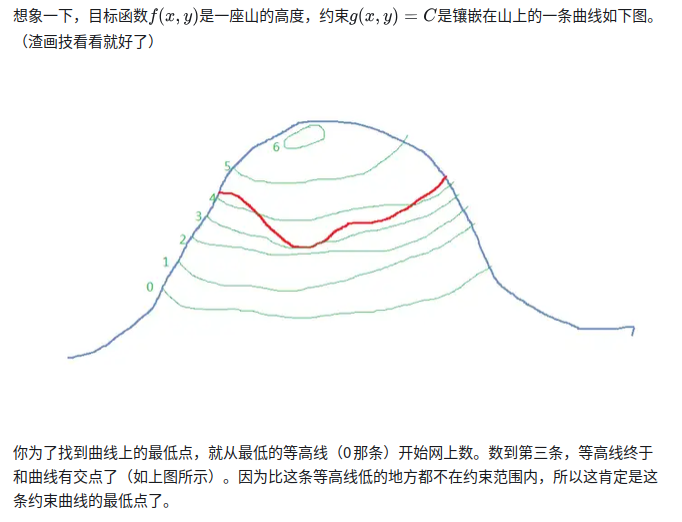
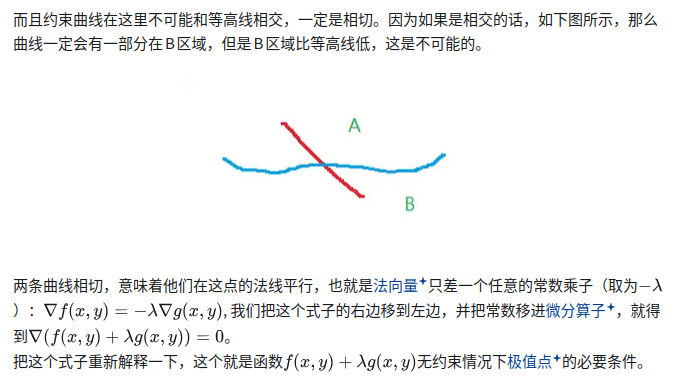
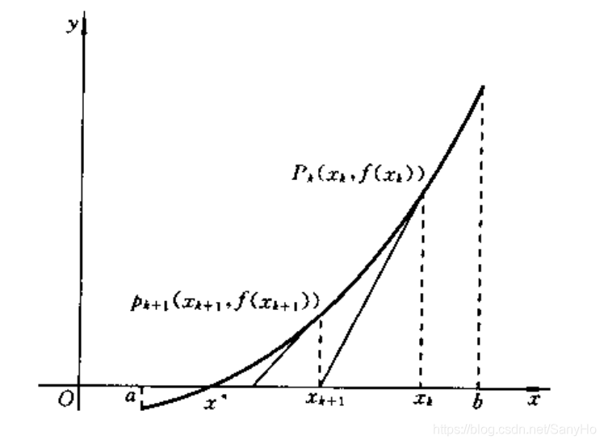

## 1. 理解非线性规划（NLP）在逆运动学（IK）中的作用
假设机械臂关节角变量为：
$$\boldsymbol{q} = [q_1, q_2, \dots, q_6]^T$$
通过正运动学（Forward Kinematics, FK）：
$$\boldsymbol{T}(\boldsymbol{q}) = \text{FK}(\boldsymbol{q})$$
可以得到末端的位置和姿态：
$$\boldsymbol{x}(\boldsymbol{q}) = \begin{bmatrix} \boldsymbol{p}(\boldsymbol{q}) \\ \boldsymbol{R}(\boldsymbol{q}) \end{bmatrix}$$
给定目标位姿：
$$\boldsymbol{x}_d = \begin{bmatrix} \boldsymbol{p}_d \\ \boldsymbol{R}_d \end{bmatrix}$$
传统的代数解法希望直接求解等式：
$$\boldsymbol{x}(\boldsymbol{q}) = \boldsymbol{x}_d$$
而 **NLP 的思路** 不是解析求解该方程，而是将其转换为一个优化问题：
$$\boldsymbol{q}^* = \arg\min_{\boldsymbol{q}} f(\boldsymbol{q})$$
通过优化器不断调整 $\boldsymbol{q}$，最终使得：
$$\text{FK}(\boldsymbol{q}) \approx \boldsymbol{x}_d$$
---

## 2. 最简单的 NLP IK 模型（仅考虑位置）
假设仅考虑末端位置：
$$\boldsymbol{p}(\boldsymbol{q}) = \begin{bmatrix} x(\boldsymbol{q}) \\ y(\boldsymbol{q}) \\ z(\boldsymbol{q}) \end{bmatrix}$$
目标位置为：
$$\boldsymbol{p}_d = \begin{bmatrix} x_d \\ y_d \\ z_d \end{bmatrix}$$
可定义目标函数：
$$f(\boldsymbol{q}) = \frac{1}{2} \Vert{}\boldsymbol{p}(\boldsymbol{q}) - \boldsymbol{p}_d\Vert{}^2$$
此时，IK 问题转换为极小化问题：
$$\boldsymbol{q}^* = \arg\min_{\boldsymbol{q}} \frac{1}{2} \Vert{}\boldsymbol{p}(\boldsymbol{q}) - \boldsymbol{p}_d\Vert{}^2$$
这就是最基本的 NLP 数学模型。
---

## 3. 加入姿态误差
实际机械臂运动规划通常需要同时约束位置与姿态。
* **位置误差**：
  $$\boldsymbol{e}_p = \boldsymbol{p}(\boldsymbol{q}) - \boldsymbol{p}_d$$
* **姿态误差**（利用李代数 / Log 映射）：
  $$\boldsymbol{e}_R = \text{Log}(\boldsymbol{R}_d^T \boldsymbol{R}(\boldsymbol{q}))$$

  ### 姿态误差求解：SO(3) 上的 Log 映射
#### 1. 最常见的一种：旋转向量误差
给定两个旋转矩阵：
* $R_d$：目标旋转矩阵（Desired Rotation Matrix）
* $R$：当前旋转矩阵（Current Rotation Matrix）
使用以下形式定义相对旋转矩阵：
$$R_e = R_d^T R$$
实际上定义的是**目标坐标系到当前坐标系**方向的姿态误差。
* **$R_e = R_d^T R$ 表示**：从 **目标坐标系** $\rightarrow$ **当前坐标系** 的姿态变换。

#### 2. $SO(3)$ 的 Log 映射
对于任意旋转矩阵 $R_e \in SO(3)$，存在对应的反对称矩阵指数关系：
$$R_e = \exp([\boldsymbol{\phi}]_{\times})$$
其中，$\boldsymbol{\phi} \in \mathbb{R}^3$ 即为**旋转向量（Rotation Vector）**。
因此，姿态误差向量 $\boldsymbol{e}_R$ 可以通过 Log 映射与 Vee 算子 $(\cdot)^{\vee}$ 计算：
$$\boldsymbol{e}_R = \left( \text{Log}(R_d^T R) \right)^{\vee}$$
其中，$[\boldsymbol{\phi}]_{\times}$ 表示由向量 $\boldsymbol{\phi} = [\phi_x, \phi_y, \phi_z]^T$ 构建的反对称矩阵：
$$[\boldsymbol{\phi}]_{\times} = \begin{bmatrix} 0 & -\phi_z & \phi_y \\ \phi_z & 0 & -\phi_x \\ -\phi_y & \phi_x & 0 \end{bmatrix}$$
而 Vee 算子 $(\cdot)^{\vee}$ 是它的逆运算，作用是将反对称矩阵还原为三维列向量：
$$[\boldsymbol{\phi}]_{\times}^{\vee} = \boldsymbol{\phi}$$

#### 3. 为什么 Log 映射能准确提取姿态误差？
1. **$SO(3)$ 是非线性流形**：
   旋转矩阵构成的特殊正交群 $SO(3)$ 是一个弯曲的非线性流形。我们不能像计算三维位置误差（$\boldsymbol{p} - \boldsymbol{p}_d$）那样，简单地使用两矩阵作差 $R - R_d$。

2. **矩阵乘法不可交换**：
   旋转复合满足非对易性（即一般情况下 $R_1 R_2 \neq R_2 R_1$）。虽然直接使用 $R - R_d$ 的矩阵范数可以在数学上定义优化代价，但它缺乏物理直观性，且无法直接作为 3 自由度的旋转增量。

3. **切空间映射**：
   Log 映射将弯曲流形 $SO(3)$ 上的点切映射到其李代数 $so(3)$（同构于平坦的三维欧氏空间 $\mathbb{R}^3$）：

$$\text{Log}: SO(3) \rightarrow so(3) \cong \mathbb{R}^3$$
因此，定义姿态误差向量为：
$$\boldsymbol{e}_R = \left( \text{Log}(R_d^T R) \right)^{\vee}$$
能够完美兼具数学严谨性与直观的物理意义（即**模长表示需旋转的角度，方向表示旋转轴**）。

合并为全局位姿误差向量：
$$\boldsymbol{e}(\boldsymbol{q}) = \begin{bmatrix} \boldsymbol{e}_p \\ \boldsymbol{e}_R \end{bmatrix}$$
定义带权重的目标函数：
$$f(\boldsymbol{q}) = \frac{1}{2} \boldsymbol{e}(\boldsymbol{q})^T \boldsymbol{W} \boldsymbol{e}(\boldsymbol{q})$$
其中权重矩阵 $\boldsymbol{W}$ 为：
$$\boldsymbol{W} = \begin{bmatrix} w_p \boldsymbol{I}_3 & \mathbf{0} \\ \mathbf{0} & w_R \boldsymbol{I}_3 \end{bmatrix}$$
因此，带姿态约束的 NLP IK 表达为：
$$\boldsymbol{q}^* = \arg\min_{\boldsymbol{q}} \frac{1}{2} \boldsymbol{e}(\boldsymbol{q})^T \boldsymbol{W} \boldsymbol{e}(\boldsymbol{q})$$

---

## 4. NLP 与 SQP（序列二次规划）的关系
* **NLP 是问题描述形式，其核心在于：定义决策变量、目标函数和约束条件，然后寻找满足约束的最优变量。**（Problem Standard Formulation）
* **SQP 是求解 NLP 的算法**（Optimization Solver Method）

#### NLP 的标准数学形式

$$\begin{aligned} & \min_{\boldsymbol{x}} & & f(\boldsymbol{x}) \\ & \text{s.t.} & & \boldsymbol{g}(\boldsymbol{x}) = \mathbf{0} \\ & & & \boldsymbol{h}(\boldsymbol{x}) \le \mathbf{0} \\ & & & \boldsymbol{x}_{\min} \le \boldsymbol{x} \le \boldsymbol{x}_{\max} \end{aligned}$$
#### 各符号含义说明：
* $\boldsymbol{x}$：**决策变量**（Decision Variables）
* $f(\boldsymbol{x})$：**目标函数**（Objective Function）
* $\boldsymbol{g}(\boldsymbol{x})$：**等式约束**（Equality Constraints）
* $\boldsymbol{h}(\boldsymbol{x})$：**不等式约束**（Inequality Constraints）
* $\boldsymbol{x}_{\min}, \boldsymbol{x}_{\max}$：**变量上下限**（Bounds / Box Constraints）

非线性规划最终要求解的是 **最优决策变量 $\boldsymbol{x}^*$**，而不是单纯地“计算目标函数值”。
更准确地说：
> **找到一组满足所有约束条件的决策变量 $\boldsymbol{x}^*$，使得目标函数值 $f(\boldsymbol{x}^*)$ 尽可能小。**


可以使用多种算法/求解器对其求解：
* **SQP** (Sequential Quadratic Programming)
* **Interior Point** (内点法 / 如 IPOPT)
* **Active Set** (有效集法)
* **工程求解器**：SNOPT, WORHP, KNITRO 等    
整体结构映射关系如下：
```text
                 IK 问题
                   │
                   ▼
             建立 NLP 模型
                   │
          ┌────────┼────────┐
          │        │        │
         SQP   Interior   Active Set
                 Point
          │
          ▼
       求解出 q*
```

---

## 线性规划问题是全局最优么？
在线性规划（LP）中，只要问题是凸的，那么任何局部最优解都是全局最优解。而线性规划天然就是凸优化问题，所以才有这个性质。

#### 1. 标准线性规划（Linear Programming, LP）表达形式
$$\begin{aligned} & \min_{\boldsymbol{x}} & & \boldsymbol{c}^T \boldsymbol{x} \\ & \text{s.t.} & & \boldsymbol{A}\boldsymbol{x} \le \boldsymbol{b} \end{aligned}$$
主要特征：
1. **目标函数**：$f(\boldsymbol{x}) = \boldsymbol{c}^T \boldsymbol{x}$ 是线性的。
2. **约束条件**：$\boldsymbol{A}\boldsymbol{x} \le \boldsymbol{b}$ 也是线性的。

#### 2. 核心特征：构成凸可行域（Convex Feasible Region）
以二维空间为例：
$$\begin{aligned} x_1 + x_2 &\le 4 \\ x_1 &\ge 0 \\ x_2 &\ge 0 \end{aligned}$$
其对应的可行域如下图所示：
```text
x2
↑
│
│       ●
│      /│
│     / │
│    /  │
│   /   │
│  /    │
│ /_____│
└──────────→ x1

```

该可行域具有一个至关重要的几何性质：
> **可行域内任意两点之间的连线段，整条线段上的点都完全包含在该可行域内部。**
具有该性质的集合称为：**凸集（Convex Set）**。


#### 3. 线性目标函数的凸性分析
线性函数 $f(\boldsymbol{x}) = \boldsymbol{c}^T \boldsymbol{x}$ 满足凸组合的线性叠加原理：
$$f(\lambda \boldsymbol{x}_1 + (1-\lambda) \boldsymbol{x}_2) = \lambda f(\boldsymbol{x}_1) + (1-\lambda) f(\boldsymbol{x}_2) \quad (\forall \, 0 \le \lambda \le 1)$$
根据凸函数的标准定义，要求满足：
$$f(\lambda \boldsymbol{x}_1 + (1-\lambda) \boldsymbol{x}_2) \le \lambda f(\boldsymbol{x}_1) + (1-\lambda) f(\boldsymbol{x}_2)$$
线性函数由于等号严格成立，因此满足：
> **线性函数既是凸函数（Convex Function），也是凹函数（Concave Function）。**

#### 4. 机械臂逆运动学（IK）中的非凸性与 Warm Start（热启动）
当前基于非线性规划（NLP）的逆运动学计算公式通常写为：
$$\min_{\boldsymbol{q}} \quad \|\boldsymbol{p}(\boldsymbol{q}) - \boldsymbol{p}_d\|^2 + \|\boldsymbol{e}_R(\boldsymbol{q})\|^2$$
由于正运动学过程：
$$\boldsymbol{p}(\boldsymbol{q}) = \text{FK}(\boldsymbol{q})$$
包含大量三角函数的复合映射，具有高度的非线性特征。该 NLP 问题本质上是一个 **非凸优化问题**。非凸优化的核心性质在于：
$$\text{局部最优解} \;\nRightarrow\; \text{全局最优解}$$
这意味着使用如 **IPOPT** 等基于梯度/内点法的求解器算出的 IK 解 $\boldsymbol{q}^*$，并不一定是全局唯一的最优解。
它极有可能是求解器：
> **从给定的初始值 $\boldsymbol{q}_0$ 出发，在梯度方向上搜索到的一个局部最优解。**

为什么 Warm Start（热启动）在 CasADi + IPOPT IK 中至关重要？在基于 CasADi 与 IPOPT 搭建的 IK 系统中，将上一次计算得到的关节解作为下一次迭代的初始点（`warm_start`），具有两重决定性作用：
1. **加速收敛**：显著减少求解器内部迭代步数，降低实时运算耗时。
2. **构型连续性与解的选择**：由于非凸空间存在多个局部极小值（对应机械臂的多种肘部/手腕姿态构型），初始点 $\boldsymbol{q}_0$ 会直接决定 IPOPT 最终收敛到哪一个局部解。通过热启动引入上一时刻的位姿，能保证机械臂在运动过程中的构型连续性，避免关节角度发生突变。

## 内点法
#### 1. 问题起点：带不等式约束的优化
假设存在一个带不等式约束的优化问题：
$$\begin{aligned} & \min_{\boldsymbol{x}} & & f(\boldsymbol{x}) \\ & \text{s.t.} & & g_i(\boldsymbol{x}) \le 0, \quad i = 1, \dots, m \end{aligned}$$
其中：
* $f(\boldsymbol{x})$：目标函数
* $g_i(\boldsymbol{x}) \le 0$：不等式约束（如控制输入限位、状态边界等）
求解目标是寻找一个既满足所有约束条件、又能使目标函数达到最小的优化变量 $\boldsymbol{x}^*$。

#### 2. 直接在边界上搜索的局限性
一种直观思路是沿可行域边界搜索（许多经典优化问题的最优解往往位于约束生效的边界上）。
但在实际工程中面临以下困难：
* **高维几何复杂**：在边界搜索需要识别并追踪所有活跃约束（Active Constraints）构成的交线，在高维空间中计算极其繁琐。
* **非线性数值不稳定**：对于非线性规划问题，直接约束在边界上移动极易引发数值抖动，导致收敛缓慢甚至失败。

#### 3. 核心思想：从内部搜索，逐步逼近边界
为了规避“直接卡在边界”的问题，内点法提出了以下策略：
1. **域内搜索**：优先在可行域内部（即所有约束均满足严格不等式 $g_i(\boldsymbol{x}) < 0$ 的区域）进行迭代搜索。由于内部约束较少，可以直接应用连续梯度法高效寻优。
2. **渐进逼近**：随着迭代深入，在保证解始终可行（不越界）的前提下，逐渐向真实的边界最优解靠拢。

#### 4. 关键机制：对数障碍函数（Logarithmic Barrier Function）
为确保迭代点始终维持在可行域内部，内点法引入了**障碍函数**机制。

##### 4.1 负对数项结构
对每个不等式约束 $g_i(\boldsymbol{x}) \le 0$，引入负对数惩罚项：
$$-\log(-g_i(\boldsymbol{x}))$$
* **可行域内部**（$g_i(\boldsymbol{x}) < 0$）：$-g_i(\boldsymbol{x}) > 0$，对数项有定义且值有限。
* **逼近边界时**（$g_i(\boldsymbol{x}) \to 0^-$）：$-g_i(\boldsymbol{x}) \to 0^+$，此时对数项 $\log(-g_i(\boldsymbol{x})) \to -\infty$。
* **施加惩罚**：经负号作用后，$-\log(-g_i(\boldsymbol{x})) \to +\infty$，在可行域边缘形成一道陡峭的“数值高墙”，阻止解穿透边界。

##### 4.2 构建障碍目标函数
将原始目标函数与所有约束的对数障碍项进行组合：
$$B(\boldsymbol{x}, \mu) = f(\boldsymbol{x}) - \mu \sum_{i=1}^{m} \log(-g_i(\boldsymbol{x}))$$
* $\mu > 0$：**障碍参数**（Barrier Parameter）。
* 当 $\mu$ 较大时，边界惩罚权重高，最优解偏向可行域中心；当 $\mu$ 逐渐减小时，惩罚效果削弱，允许解进一步贴近真实边界。

#### 5. 迭代逼近求解流程
内点法通过序列化求解一系列子问题来逼近原问题的全局最优解：
1. **初始化**：选择较大的障碍参数 $\mu$，对较平缓的 $B(\boldsymbol{x}, \mu)$ 进行无约束/等式约束优化，得到可行域内的一个初始解。
2. **衰减参数**：逐步降低障碍参数 $\mu$ 的值。
3. **子问题求解**：利用**牛顿法（Newton's Method）**结合 **KKT 条件** 求解当前的子问题 $\min_{\boldsymbol{x}} B(\boldsymbol{x}, \mu)$。
4. **收敛判断**：重复上述过程，当 $\mu \to 0$ 时，序列解连成的“中心轨迹（Central Path）”最终精确收敛于原问题的最优解 $\boldsymbol{x}^*$。

#### 6. 内点法 vs. 单纯形法
| 维度 | 单纯形法（Simplex Method） | 内点法（Interior Point Method） |
| :--- | :--- | :--- |
| **搜索路径** | 沿可行域凸多面体的**顶点与棱边**移动 | 从可行域**内部**沿中心轨迹穿越逼近 |
| **适用场景** | 线性规划（LP） | 非线性规划（NLP）、二次规划（QP）、大规模问题 |
| **高维扩展性** | 高维非线性下易发生顶点组合爆炸 | 基于梯度与 Hessian 矩阵，高维扩展性能优异 |

#### 7. 在 MPC / 机器人控制中的工程应用
在模型预测控制（MPC）与机器人运动规划中，主流求解器（如 **IPOPT**、**ForcesNLP** 等）均依赖内点法处理以下核心约束：
* **多步预测时域** 内的非线性系统动力学约束
* **执行器物理限位**（如关节电机扭矩上限、转速上限）
* **状态空间约束**（如机器人避障、末端位置边界）
内点法凭借其良好的数值稳定性和对大规模稀疏矩阵的高效处理能力，为无人机、机械臂及足式机器人的实时轨迹优化提供了坚实的算法支撑。

### 小结：内点法的一句话总结
> **内点法是一种在可行域“内部”迭代搜索的求解策略，通过“障碍函数”阻挡解跑出可行域，并逐步放松障碍参数，最终逼近最优解和约束边界。**
这就是内点法的核心“推理过程”：与其从边界开始，不如在“里层”走，让数值算法更稳定，再慢慢让解贴近约束边界，从而找到最优。

#### 8. 整体思路与算法框架
本例求解的目标优化问题为：
$$\begin{aligned} & \min_{\boldsymbol{x}} & & f(\boldsymbol{x}) = x_1 + x_2 + x_3 \\ & \text{s.t.} & & x_1^2 + x_2^2 + x_3^2 \le 1 \end{aligned}$$
* **可行域**：单位球体 $\{\boldsymbol{x} \in \mathbb{R}^3 : \|\boldsymbol{x}\| \le 1\}$。
* **内点法处理**：将不等式约束 $g(\boldsymbol{x}) = x_1^2 + x_2^2 + x_3^2 - 1 \le 0$ 重写为 $h(\boldsymbol{x}) > 0$，其中：
$$h(\boldsymbol{x}) = 1 - (x_1^2 + x_2^2 + x_3^2)$$
此时 $h(\boldsymbol{x}) > 0$ 等价于 $\boldsymbol{x}$ 严格处于球体内部（$x_1^2 + x_2^2 + x_3^2 < 1$）。

* **障碍目标函数**：定义为：
$$B(\boldsymbol{x}, \mu) = f(\boldsymbol{x}) - \mu \ln\bigl(h(\boldsymbol{x})\bigr)$$
其中 $\mu > 0$ 为障碍参数（Barrier Parameter）。随着 $\mu$ 的减小，$-\mu \ln h(\boldsymbol{x})$ 的作用逐渐衰减，允许解逐步向边界逼近并最终收敛于全局最优解。

#### 9. 算法双层循环逻辑：

* **外层循环**（最多 `max_outer` 次）：
  1. 在固定当前 $\mu$ 的条件下求解 $\min_{\boldsymbol{x}} B(\boldsymbol{x}, \mu)$；
  2. 衰减障碍参数：$\mu \leftarrow \mu \cdot \text{mu\_decay}$；
  3. 当 $\mu$ 足够小或达到最大次数时终止。
* **内层循环**（最多 `max_inner` 次）：
  1. 计算当前障碍目标的梯度 $\nabla B(\boldsymbol{x}, \mu)$；
  2. 执行固定步长梯度下降：$\boldsymbol{x} \leftarrow \boldsymbol{x} - \alpha \nabla B(\boldsymbol{x}, \mu)$；
  3. **边界保护**：若新点 $\boldsymbol{x}_{\text{new}}$ 超出可行域（$h(\boldsymbol{x}_{\text{new}}) \le 0$），则缩小步长重试；
  4. **收敛判定**：若 $\|\boldsymbol{x}_{\text{new}} - \boldsymbol{x}\| < \text{tol}$，则完成当前 $\mu$ 下的收敛，跳出内层循环。

#### 10. 代码主干解析

MATLAB 核心求解代码实现如下：
```matlab
function x_history = interior_point_3d_solve()
    % 参数配置
    mu_init   = 1.0;      % 初始障碍参数
    mu_decay  = 0.2;      % mu 的衰减因子
    alpha     = 0.001;    % 梯度下降步长
    tol       = 1e-6;     % 内层收敛阈值
    max_outer = 10;       % 最大外层循环次数
    max_inner = 50;       % 每次 mu 下最大内层迭代次数

    % 初始化可行解 (起点位于原点, 处于球内)
    x = [0; 0; 0];  
    mu = mu_init;

    x_history = [];

    for outer = 1:max_outer
        for inner = 1:max_inner
            g = grad_B(x, mu);  
            x_new = x - alpha * g;

            % 越界保护：若越过球边界 => h(x_new) <= 0
            if h_3d(x_new) <= 1e-9
                x_new = x - 0.1 * alpha * g;  % 缩小步长再试
            end

            % 内层收敛判断
            if norm(x_new - x) < tol
                x = x_new;
                break;  % 跳出内层循环
            end

            x = x_new;
            x_history = [x_history; x']; 
        end

        % 衰减障碍参数 mu
        mu = mu * mu_decay;
        if mu < 1e-12
            break;  % mu 已足够小，终止计算
        end
    end

    % 记录最终点
    x_history = [x_history; x'];
end

```
参数设置说明：
1. `mu_init = 1.0`，每次外层迭代乘以 `0.2` 衰减，使障碍惩罚逐步放松。
2. `alpha = 0.001` 为固定更新步长，结合 `max_inner = 50` 确保数值更新平稳。
3. 越界检查逻辑：
```matlab
if h_3d(x_new) <= 1e-9
    x_new = x - 0.1 * alpha * g;  % 步长缩小 10 倍
end
```
该机制能够防止固定步长更新时“冲出”可行域。

#### 11. 障碍函数与梯度的数学推导
可行域函数 $h(\boldsymbol{x})$
```matlab
function val = h_3d(x)
    val = 1.0 - (x(1)^2 + x(2)^2 + x(3)^2);
end
```
数学表达为 $h(\boldsymbol{x}) = 1 - r^2$，其中 $r^2 = x_1^2 + x_2^2 + x_3^2$。在球体内部保持 $h(\boldsymbol{x}) > 0$。

障碍目标函数 $B(\boldsymbol{x}, \mu)$
```matlab
function val = B_3d(x, mu)
    val = f_3d(x) - mu * log(h_3d(x));
end
```
对应数学公式：
$$B(\boldsymbol{x}, \mu) = f(\boldsymbol{x}) - \mu \ln\bigl(h(\boldsymbol{x})\bigr)$$

梯度 $\nabla B(\boldsymbol{x}, \mu)$ 的推导
对障碍目标函数求梯度：
$$\nabla B(\boldsymbol{x}, \mu) = \nabla f(\boldsymbol{x}) - \mu \nabla \ln\bigl(h(\boldsymbol{x})\bigr)$$
根据复合函数求导法则：
$$\nabla \ln\bigl(h(\boldsymbol{x})\bigr) = \frac{1}{h(\boldsymbol{x})} \nabla h(\boldsymbol{x})$$
代入 $h(\boldsymbol{x}) = 1 - r^2$，其梯度为 $\nabla h(\boldsymbol{x}) = -2\boldsymbol{x}$，故：
$$\nabla \ln\bigl(h(\boldsymbol{x})\bigr) = \frac{-2\boldsymbol{x}}{1 - r^2}$$
代入原式得障碍项的梯度贡献为 $+\frac{2\mu \boldsymbol{x}}{1 - r^2}$。
对于目标函数 $f(\boldsymbol{x}) = x_1 + x_2 + x_3$，其梯度为 $\nabla f(\boldsymbol{x}) = (1, 1, 1)^T$。
最终障碍目标函数的梯度解析解为：
$$\nabla B(\boldsymbol{x}, \mu) = \begin{bmatrix} 1 \\ 1 \\ 1 \end{bmatrix} + \frac{2\mu}{1 - r^2} \begin{bmatrix} x_1 \\ x_2 \\ x_3 \end{bmatrix}$$
对应代码实现：
```matlab
function g = grad_B(x, mu)
    hx = h_3d(x);  % 1 - r^2
    dB_dx0 = 1.0 + (2.0 * mu * x(1) / hx);
    dB_dx1 = 1.0 + (2.0 * mu * x(2) / hx);
    dB_dx2 = 1.0 + (2.0 * mu * x(3) / hx);

    g = [dB_dx0; dB_dx1; dB_dx2];
end
```
代码中的 `1.0` 对应目标函数梯度 $\nabla f(\boldsymbol{x})$，`(2.0 * mu * x(i) / hx)` 精确对应障碍项的梯度的各个分量。

## SQP

### sqp
#### 1. 建立基础：从原始 NLP 到 KKT 非线性方程组
考虑标准非线性规划（NLP）问题：
$$\begin{aligned} & \min_{\boldsymbol{x}} & & f(\boldsymbol{x}) \\ & \text{s.t.} & & \boldsymbol{g}(\boldsymbol{x}) = \mathbf{0} \\ & & & \boldsymbol{h}(\boldsymbol{x}) \le \mathbf{0} \end{aligned}$$
首先构造拉格朗日函数（Lagrangian）：
$$\mathcal{L}(\boldsymbol{x}, \boldsymbol{\lambda}, \boldsymbol{\mu}) = f(\boldsymbol{x}) + \boldsymbol{\lambda}^T \boldsymbol{g}(\boldsymbol{x}) + \boldsymbol{\mu}^T \boldsymbol{h}(\boldsymbol{x})$$
根据优化理论，该 NLP 问题的高阶最优解必须满足 **KKT 条件（Karush-Kuhn-Tucker Conditions）**。
把所有 KKT 方程与互补松弛条件组合起来，可以写成一个统一的非线性方程组：
$$\boldsymbol{F}(\boldsymbol{x}, \boldsymbol{\lambda}, \boldsymbol{\mu}) = \mathbf{0}$$
> **注意**：这里的 $\boldsymbol{F}$ 并不是原始的目标函数 $f(\boldsymbol{x})$，而是**由整个 KKT 一阶条件组成的非线性方程组**。

#### 2. 对 KKT 方程组应用牛顿法（Newton's Method）
传统的牛顿法用于求解根方程 $\boldsymbol{F}(\boldsymbol{y}) = \mathbf{0}$，其中合体状态变量为：
$$\boldsymbol{y} = \begin{bmatrix} \boldsymbol{x} \\ \boldsymbol{\lambda} \\ \boldsymbol{\mu} \end{bmatrix}$$
在当前迭代点 $\boldsymbol{y}_k$ 处，对 $\boldsymbol{F}(\boldsymbol{y})$ 进行一阶泰勒展开近似：
$$\boldsymbol{F}(\boldsymbol{y}_k + \Delta\boldsymbol{y}) \approx \boldsymbol{F}(\boldsymbol{y}_k) + \boldsymbol{J}_{\boldsymbol{F}}(\boldsymbol{y}_k) \Delta\boldsymbol{y}$$
令其等于零以求解迭代增量：
$$\boldsymbol{F}(\boldsymbol{y}_k) + \boldsymbol{J}_{\boldsymbol{F}}(\boldsymbol{y}_k) \Delta\boldsymbol{y} = \mathbf{0} \implies \boldsymbol{J}_{\boldsymbol{F}}(\boldsymbol{y}_k) \Delta\boldsymbol{y} = -\boldsymbol{F}(\boldsymbol{y}_k)$$
这就是针对 KKT 系统施加的 **Newton 迭代**。
> **核心厘清**：这里的牛顿法不是“直接求函数的梯度”，而是**利用牛顿法去求解 KKT 方程组 $\boldsymbol{F}(\boldsymbol{y}) = \mathbf{0}$ 的零点**。

#### 3. 最关键的一步：QP（二次规划）的等价呈现
数学上可以证明，上述针对 KKT 方程求解的 Newton 增量步 $\Delta\boldsymbol{x}$，**精确地等价于求解以下二次规划（QP）问题的最优解**：
$$\begin{aligned} & \min_{\Delta\boldsymbol{x}} & & \frac{1}{2} \Delta\boldsymbol{x}^T \boldsymbol{H}_k \Delta\boldsymbol{x} + \nabla f(\boldsymbol{x}_k)^T \Delta\boldsymbol{x} \\ & \text{s.t.} & & \boldsymbol{g}(\boldsymbol{x}_k) + \boldsymbol{J}_{\boldsymbol{g}}(\boldsymbol{x}_k) \Delta\boldsymbol{x} = \mathbf{0} \\ & & & \boldsymbol{h}(\boldsymbol{x}_k) + \boldsymbol{J}_{\boldsymbol{h}}(\boldsymbol{x}_k) \Delta\boldsymbol{x} \le \mathbf{0} \end{aligned}$$
其中 $\boldsymbol{H}_k = \nabla_{\boldsymbol{x}\boldsymbol{x}}^2 \mathcal{L}(\boldsymbol{x}_k, \boldsymbol{\lambda}_k, \boldsymbol{\mu}_k)$ 为拉格朗日函数的 Hessian 矩阵。
$$\text{对 KKT 执行一次 Newton Step} \;\;\Longleftrightarrow\;\; \text{求解一个子 QP 问题}$$
这就是 **SQP（序列二次规划）** 的数学核心机制。

#### 4. 为什么 QP 的目标函数恰好是二次的？
在当前点 $\boldsymbol{x}_k$ 处对拉格朗日函数/目标函数进行二阶泰勒展开：
$$f(\boldsymbol{x}_k + \Delta\boldsymbol{x}) \approx f(\boldsymbol{x}_k) + \nabla f(\boldsymbol{x}_k)^T \Delta\boldsymbol{x} + \frac{1}{2} \Delta\boldsymbol{x}^T \boldsymbol{H}_k \Delta\boldsymbol{x}$$
忽略常数项 $f(\boldsymbol{x}_k)$（不影响求导与极值点定位），即得到：
$$\frac{1}{2} \Delta\boldsymbol{x}^T \boldsymbol{H}_k \Delta\boldsymbol{x} + \nabla f(\boldsymbol{x}_k)^T \Delta\boldsymbol{x}$$
这就是 QP 二次目标函数的来源。

#### 5. 为什么约束条件恰好是线性的？
在当前点 $\boldsymbol{x}_k$ 处对非线性约束 $\boldsymbol{g}(\boldsymbol{x}) = \mathbf{0}$ 进行一阶泰勒展开（局部线性化）：
$$\boldsymbol{g}(\boldsymbol{x}_k + \Delta\boldsymbol{x}) \approx \boldsymbol{g}(\boldsymbol{x}_k) + \boldsymbol{J}_{\boldsymbol{g}}(\boldsymbol{x}_k) \Delta\boldsymbol{x} = \mathbf{0}$$
这构成了标准的**线性等式/不等式约束**。
结合上述两点：
$$\text{二次目标函数} + \text{线性约束条件} = \mathbf{QP \text{（二次规划）}}$$

#### 6. SQP 算法逻辑全景推导链
你可以将 SQP 的本质提炼为以下逻辑闭环：
```text
               原始 NLP 问题
                     │
                     ▼
           构造 Lagrangian 函数 L(x, λ, μ)
                     │
                     ▼
            建立 KKT 条件 F(x, λ, μ) = 0
                     │
                     ▼
          对 KKT 方程建立 Newton 系统 J_F Δy = -F
                     │
                     ▼
         等价转化为局部子 QP 问题求解 Δx
                     │
                     ▼
            求解 QP 得到增量 Δx
                     │
                     ▼
       更新迭代点 x_{k+1} = x_k + α Δx
                     │
                     ▼
    重新计算 Hessian/Jacobian 构建新的 QP_{k+1}
                     │
                     └───> 循环直到收敛
```

### 7. 理解 "Sequential"（序列化）的真实含义

SQP 并不是通过**一次**简单的转换将 NLP 变成单个 QP 就能直接算出答案。

其真实求解过程是一个迭代序列：

$$\mathbf{NLP} \;\;\longrightarrow\;\; \mathbf{QP}_0 \;\;\longrightarrow\;\; \mathbf{QP}_1 \;\;\longrightarrow\;\; \mathbf{QP}_2 \;\;\longrightarrow\;\; \dots \;\;\longrightarrow\;\; \boldsymbol{x}^*$$

每一个子 $\text{QP}_k$ 都是在当前状态点 $\boldsymbol{x}_k$ 局部构建出来的局部二次近似模型，通过解决这一系列连续的 QP 子问题，最终收敛到原非线性规划（NLP）问题的最优解。

### QP（二次规划）
标准 QP（Quadratic Programming）问题通常写成以下形式：
$$\begin{aligned} & \min_{\boldsymbol{x}} & & \frac{1}{2} \boldsymbol{x}^T \boldsymbol{H} \boldsymbol{x} + \boldsymbol{c}^T \boldsymbol{x} \\ & \text{s.t.} & & \boldsymbol{A}\boldsymbol{x} = \boldsymbol{b} \\ & & & \boldsymbol{G}\boldsymbol{x} \le \boldsymbol{h} \end{aligned}$$
其中：
* $\boldsymbol{x}$：QP 求解的决策变量（在 SQP 框架下，$\boldsymbol{x}$ 即为关节增量 $\Delta \boldsymbol{q}$，代表下一步机械臂关节的移动量）
* $\boldsymbol{H}$：二次项 Hessian 矩阵（对称正定或半正定）
* $\boldsymbol{c}$：一次项梯度向量
* $\boldsymbol{A}\boldsymbol{x} = \boldsymbol{b}$：线性等式约束
* $\boldsymbol{G}\boldsymbol{x} \le \boldsymbol{h}$：线性不等式约束

#### 2. 无约束 QP 问题的求解
如果 QP 问题没有任何约束：
$$\min_{\boldsymbol{x}} \quad \frac{1}{2} \boldsymbol{x}^T \boldsymbol{H} \boldsymbol{x} + \boldsymbol{c}^T \boldsymbol{x}$$
对目标函数求导并令其等于零：
$$\nabla f(\boldsymbol{x}) = \boldsymbol{H}\boldsymbol{x} + \boldsymbol{c} = \mathbf{0} \implies \boldsymbol{H}\boldsymbol{x} = -\boldsymbol{c}$$
求解该线性方程组即可直接得到最优解 $\boldsymbol{x}^*$（**无需迭代梯度下降，一步直接求解**）：
$$\boldsymbol{x}^* = -\boldsymbol{H}^{-1}\boldsymbol{c}$$

#### 示例：
假设 $\boldsymbol{H} = \begin{bmatrix} 2 & 0 \\ 0 & 4 \end{bmatrix}$，$\boldsymbol{c} = \begin{bmatrix} -4 \\ -8 \end{bmatrix}$，求解 $\boldsymbol{H}\boldsymbol{x} = -\boldsymbol{c}$：
$$\begin{bmatrix} 2 & 0 \\ 0 & 4 \end{bmatrix} \begin{bmatrix} x_1 \\ x_2 \end{bmatrix} = \begin{bmatrix} 4 \\ 8 \end{bmatrix} \implies \begin{cases} 2x_1 = 4 \implies x_1 = 2 \\ 4x_2 = 8 \implies x_2 = 2 \end{cases}$$
最优解为 $\boldsymbol{x}^* = \begin{bmatrix} 2 \\ 2 \end{bmatrix}$。

#### 3. 含等式约束的 QP 求解
考虑仅含线性等式约束的 QP 问题：
$$\begin{aligned} & \min_{\boldsymbol{x}} & & \frac{1}{2} \boldsymbol{x}^T \boldsymbol{H} \boldsymbol{x} + \boldsymbol{c}^T \boldsymbol{x} \\ & \text{s.t.} & & \boldsymbol{A}\boldsymbol{x} = \boldsymbol{b} \end{aligned}$$
此时不能直接使用 $\boldsymbol{H}\boldsymbol{x} = -\boldsymbol{c}$，需要引入拉格朗日乘子向量 $\boldsymbol{\lambda}$ 构造拉格朗日函数：
$$\mathcal{L}(\boldsymbol{x}, \boldsymbol{\lambda}) = \frac{1}{2} \boldsymbol{x}^T \boldsymbol{H} \boldsymbol{x} + \boldsymbol{c}^T \boldsymbol{x} + \boldsymbol{\lambda}^T (\boldsymbol{A}\boldsymbol{x} - \boldsymbol{b})$$

#### 4. 建立 KKT 线性方程组
对 $\mathcal{L}(\boldsymbol{x}, \boldsymbol{\lambda})$ 分别关于 $\boldsymbol{x}$ 和 $\boldsymbol{\lambda}$ 求偏导：
$$\begin{cases} \nabla_{\boldsymbol{x}} \mathcal{L} = \boldsymbol{H}\boldsymbol{x} + \boldsymbol{c} + \boldsymbol{A}^T \boldsymbol{\lambda} = \mathbf{0} \\ \nabla_{\boldsymbol{\lambda}} \mathcal{L} = \boldsymbol{A}\boldsymbol{x} - \boldsymbol{b} = \mathbf{0} \end{cases} \implies \begin{cases} \boldsymbol{H}\boldsymbol{x} + \boldsymbol{A}^T \boldsymbol{\lambda} = -\boldsymbol{c} \\ \boldsymbol{A}\boldsymbol{x} = \boldsymbol{b} \end{cases}$$
写成块矩阵（Block Matrix）形式：
$$\begin{bmatrix} \boldsymbol{H} & \boldsymbol{A}^T \\ \boldsymbol{A} & \mathbf{0} \end{bmatrix} \begin{bmatrix} \boldsymbol{x} \\ \boldsymbol{\lambda} \end{bmatrix} = \begin{bmatrix} -\boldsymbol{c} \\ \boldsymbol{b} \end{bmatrix}$$
这就是 **QP 的 KKT 线性系统**。直接求解该线性方程组，即可同时得到最优解 $\boldsymbol{x}$ 和乘子 $\boldsymbol{\lambda}$。

#### 5. 与牛顿法（Newton's Method）的联系

* **无约束牛顿法**：$\boldsymbol{H} \Delta\boldsymbol{x} = -\nabla f$
* **等式约束 QP**：$\begin{bmatrix} \boldsymbol{H} & \boldsymbol{A}^T \\ \boldsymbol{A} & \mathbf{0} \end{bmatrix} \begin{bmatrix} \boldsymbol{x} \\ \boldsymbol{\lambda} \end{bmatrix} = \begin{bmatrix} -\boldsymbol{c} \\ \boldsymbol{b} \end{bmatrix}$
**核心结论**：带线性等式约束的 QP 问题，本质上可以通过一次性求解一个扩展的 KKT 线性方程组来完全解决。

#### 6. 主流求解算法之一：有效集法（Active Set Method）
有效集法的基本逻辑是：**预测/猜测 Active 约束集合，将它们当作等式约束处理，转化为求解 KKT 线性系统**。
#### 求解流程：
```text
                 QP 问题
                   │
                   ▼
             预测 Active 约束
                   │
                   ▼
          Active 约束 -> 等式约束
                   │
                   ▼
            求解 KKT 方程组
                   │
                   ▼
            检查所有 KKT 条件
                   │
          ┌────────┴────────┐
          │                 │
     条件满足           条件不满足
          │                 │
          ▼                 ▼
       求解结束          更新 Active 集合
                            │
                            └──→ 重新求解

```
如果求解得到的对偶变量（乘子）满足 $\boldsymbol{\lambda} \ge 0$ 且无约束违例，则猜测正确；否则调整 Active 集合并重复计算。

#### 7. 主流求解算法之二：内点法（Interior Point Method）
内点法不进行显式的 Active 集组合搜索，而是**将解限制在可行域内部，通过障碍函数逐步逼近边界**。
例如对 $x \le 2$（即 $2 - x > 0$），添加障碍项：
$$\min \quad f(x) - \mu \log(2 - x)$$
* 当 $\mu > 0$ 时，靠近边界 $x \to 2$ 会触发无穷大惩罚，确保迭代点始终处于可行域内部。
* 随迭代深入使 $\mu \to 0$，迭代点沿“中心轨迹”精准收敛到真实的最优边界解。

### 8. 总结：QP 求解器分类
在机器人轨迹优化与 SQP 框架中，标准的 QP Solver 架构分类如下：
$$\text{QP Solver} \begin{cases} \text{Active Set Method} & \text{(适合中小型密集 QP、Warm-start 效率极高)} \\ \text{Interior Point Method} & \text{(适合大规模稀疏 QP、计算稳定性强)} \end{cases}$$
> 注：在高级工程优化中，还有 **ADMM**（交替方向乘子法）、**Operator Splitting**（算子分裂法，如 OSQP 求解器）等主流算法。在 SQP/机械臂控制初期，重点掌握 **Active Set** 与 **Interior Point** 的逻辑即可。

## 朗格朗日乘数法与KKT条件

  
  
[博客：拉格朗日乘数法](https://zhuanlan.zhihu.com/p/1981747954911057183)    
[博客：KKT条件](https://doraemonjack.github.io/2025/09/10/kkt-conditions/)

## 牛顿法

通常对已知方程 $f(x) = 0$ 进行变形而构造的迭代函数 $\varphi(x)$ 不是唯一的。在实际应用中，如果希望迭代函数 $\varphi(x)$ 有一种固定格式的构造方法，就可以采用 Newton 迭代法。
Newton 迭代法的基本思想是：设法将一个非线性方程 $f(x) = 0$ 转化为某种线性方程求解，其解决问题的基础是 Taylor（泰勒）多项式。具体描述如下：
设 $f(x) = 0$ 的近似根为 $x_k$，则函数 $f(x)$ 在点 $x_k$ 附近可用一阶 Taylor 多项式 $p_1(x)$ 来近似，即：
$$p_1(x) = f(x_k) + f'(x_k)(x - x_k) \approx f(x)$$
从而得到线性方程：
$$f(x_k) + f'(x_k)(x - x_k) = 0$$
解之，得该线性方程的根 $x$，但它是 $f(x) = 0$ 的下一个新近似根，记作 $x_{k+1}$，即：
$$x_{k+1} = x_k - \frac{f(x_k)}{f'(x_k)}$$
上式实质上就是一种迭代格式，称为 Newton 迭代格式。相应地，Newton 迭代函数为：
$$\varphi(x) = x - \frac{f(x)}{f'(x)} \tag{1}$$
于是，按式 $(1)$ 构造迭代函数解方程 $f(x) = 0$ 的方法，就是 Newton 迭代法。
Newton 迭代法的几何解释如下所述：

方程 $f(x) = 0$ 的精确根 $x^*$ 为曲线 $y = f(x)$ 与 $y = 0$（即 $x$ 轴）的交点。
1. **确定切线**：设 $x_k$ 为精确根 $x^*$ 的某个初始近似值，过曲线上的点 $p_k(x_k, f(x_k))$ 作 $y = f(x)$ 的切线；
2. **交点逼近**：该切线与 $x$ 轴相交于点 $x_{k+1}$，以此 $x_{k+1}$ 作为求得的新近似值；
3. **迭代更新**：继续依次过 $p_{k+1}(x_{k+1}, f(x_{k+1}))$、$p_{k+2}(x_{k+2}, f(x_{k+2})), \dots$ 等点作曲线 $y = f(x)$ 的切线，即可逐步逼近精确根 $x^*$。
因此，Newton 法也称为**切线法**，因为它是沿着曲线 $y = f(x)$ 上某一点作切线逐步外推逼近的。
由于 $y = f(x)$ 通常为非线性曲线而非直线，从点 $p_k$ 作切线与 $x$ 轴交出的 $x_{k+1}$ 处，$f(x_{k+1})$ 一般不可能恰好为零。因此必须以 $x_{k+1}$ 作为新的起点，从与之对应的 $p_{k+1}$ 点继续作切线，重复上述步骤，直至 $f(x_{k+1})$ 充分小（逼近于零）时为止。   


## 实现相关
### 1.CasDi

**CasADi** 是一个开源的**符号计算与数值优化框架**，在机器人学、控制理论（如 MPC）及非线性优化领域应用广泛。其核心能力包括：  
* **符号变量与计算图构建**（Symbolic Variables & Expressions）
* **高效算法自动微分**（Algorithmic / Automatic Differentiation, AD）
* **快速构建非线性规划问题**（Formulating NLP / Optimal Control Problems）
* **集成高阶模型预测控制**（MPC Formulation）
* **无缝对接底层优化求解器**（原生支持 IPOPT, SNOPT, KNITRO, OSQP, qpOASES 等）

CasADi 允许定义**符号变量**以搭建计算图，并在底层自动推导精确的一阶梯度（Jacobian）与二阶导数（Hessian）。
```cpp
// 在 CasADi Opti 接口中定义 7 维优化决策变量
casadi::MX q = opti.variable(7);

```
此时的 `q` 并不是具体的浮点数，而是抽象的符号向量：
$$\boldsymbol{q} = [q_1, q_2, \dots, q_7]^T$$
CasADi 会在其内部的计算图（Expression Graph）中完整追踪并构建以下数学依赖链：
$$f(\boldsymbol{q}), \quad \nabla f(\boldsymbol{q}) = \frac{\partial f}{\partial \boldsymbol{q}}, \quad \nabla^2 f(\boldsymbol{q}) = \frac{\partial^2 f}{\partial \boldsymbol{q}^2}$$
| 维度 | Eigen | CasADi |
| --- | --- | --- |
| **操作对象** | 具体的**数值**（Numbers / Arrays） | 抽象的**数学表达式 / 计算图**（Expressions） |
| **导数计算** | 需手写解析式或利用数值差分 | 基于计算图的高效**自动微分（AD）** |
| **典型用途** | 正运动学计算、几何变换、矩阵运算 | 构建 NLP / MPC 目标与约束，并传递给 IPOPT 等求解器 |

#### 1.1 casadi::SX::sym 与 ADModel::ConfigVectorType 区别与联系

```cpp
casadi::SX q_sym = casadi::SX::sym("q", model_.nq);
```
这是 CasADi 的符号变量（Symbolic Variable）。
假设自由度 `model_.nq = 7`，那么 `q_sym` 实际上代表一个抽象的列向量：
$$\boldsymbol{q}_{sym} = [q_1, q_2, q_3, q_4, q_5, q_6, q_7]^T$$
需要注意的是，这里的 $q_1 \sim q_7$ **并不是具体的浮点数**：
* `q_sym(0)` 仅代表符号变量表达式 $q[0]$，而不是形如 `0.5 rad` 的具体数值。
CasADi 后续会基于这个符号变量建立目标函数或约束 $f(\boldsymbol{q})$，并自动提取偏导数：
$$\frac{\partial f}{\partial \boldsymbol{q}}, \quad \frac{\partial^2 f}{\partial \boldsymbol{q}^2}$$
因此，`q_sym` 的作用是明确告知 CasADi：**“在此处将 $\boldsymbol{q}$ 作为决策/符号变量。”**

```cpp
ADModel::ConfigVectorType q_ad(model_.nq);

```
这是 Pinocchio 动力学库中定义的机器人构型向量（Configuration Vector）。
这里的关键在于 `ADModel`：它是一个将底层标量类型（Scalar Type）重定向/替换为 `casadi::SX` 的 Pinocchio 模型。
因此，`ADModel::ConfigVectorType` 在底层的数据结构实际上类似于：
```cpp
Eigen::Matrix<casadi::SX, Eigen::Dynamic, 1>
```
即 `q_ad` 是一个 **Eigen 风格的向量**，但其中填充的每一个元素都是 `casadi::SX` 符号类型：
$$\boldsymbol{q}_{ad} = \begin{bmatrix} \text{casadi::SX}_0 \\ \text{casadi::SX}_1 \\ \vdots \\ \text{casadi::SX}_6 \end{bmatrix}$$
虽然它们在数学语义上都代表关节变量 $\boldsymbol{q} = [q_1, \dots, q_7]^T$，但归属的数据体系完全不同：
| 变量 | 归属体系 | 核心定位 |
| --- | --- | --- |
| **`q_sym`** | CasADi 符号表达体系 (`casadi::SX`) | 用于构建优化问题、提取雅可比/黑塞矩阵 |
| **`q_ad`** | Pinocchio 算法接口体系 (`Eigen::Matrix<casadi::SX, ...>`) | 用于传给 Pinocchio 计算正运动学/动力学 |
它们并不是两组独立无关的变量，而是**同一组符号 $\boldsymbol{q}$ 在两个不同库/接口中的容器映射**。

这句赋值代码起到了跨库适配的关键作用：
```cpp
pinocchio::casadi::copy(q_sym, q_ad);
```
它并不是简单的内存复制，而是**将 CasADi 侧的 `SX` 符号表达式拆解并桥接到 Pinocchio 兼容的 Eigen 容器 (`q_ad`) 中**。
整个数据桥接转换过程如下：
```text
CasADi 表达式体系 (q_sym)           Pinocchio 算法体系 (q_ad)
┌──────────────────────┐          ┌──────────────────────────────────────────────┐
│  casadi::SX (7x1)    │          │  Eigen::Matrix<casadi::SX, Dynamic, 1> (7x1) │
│  [ q0, q1, ..., q6 ] │ ───────> │  [ casadi::SX_0, casadi::SX_1, ..., SX_6 ]  │
└──────────────────────┘  copy()  └──────────────────────────────────────────────┘
```
完成该映射后，即可将 `q_ad` 作为参数传入 Pinocchio 的标准运动学算子中：
```cpp
pinocchio::forwardKinematics(ad_model, ad_data, q_ad);
```
此时 Pinocchio 计算出的前向运动学结果，其内部将保留完好的 **CasADi 符号计算图**。

### 2.反对乘矩阵
#### 2.1 为什么叫“反对称部分”？
对于任意方阵 $\boldsymbol{R}$，都可以唯一分解为一个**对称矩阵**和一个**反对称矩阵**之和：
$$\boldsymbol{R} = \underbrace{\frac{1}{2}(\boldsymbol{R} + \boldsymbol{R}^T)}_{\text{对称部分 } \boldsymbol{R}_s} + \underbrace{\frac{1}{2}(\boldsymbol{R} - \boldsymbol{R}^T)}_{\text{反对称部分 } \boldsymbol{R}_a}$$
其中，对称部分 $\boldsymbol{R}_s = \frac{1}{2}(\boldsymbol{R} + \boldsymbol{R}^T)$ 满足转置相等特性：
$$\boldsymbol{R}_s^T = \boldsymbol{R}_s \implies \text{对称矩阵 (Symmetric Matrix)}$$
而反对称部分 $\boldsymbol{R}_a = \frac{1}{2}(\boldsymbol{R} - \boldsymbol{R}^T)$ 满足转置变号特性：
$$\boldsymbol{R}_a^T = -\boldsymbol{R}_a \implies \text{反对称矩阵 (Skew-symmetric Matrix)}$$

### 2. 算例验证

假设有一个 $3 \times 3$ 矩阵：

$$\boldsymbol{R} = \begin{bmatrix} 1 & 2 & 3 \\ 4 & 5 & 6 \\ 7 & 8 & 9 \end{bmatrix}$$

其转置矩阵为：

$$\boldsymbol{R}^T = \begin{bmatrix} 1 & 4 & 7 \\ 2 & 5 & 8 \\ 3 & 6 & 9 \end{bmatrix}$$

计算两阵之差：

$$\boldsymbol{R} - \boldsymbol{R}^T = \begin{bmatrix} 0 & -2 & -4 \\ 2 & 0 & -2 \\ 4 & 2 & 0 \end{bmatrix}$$

乘以系数 $\frac{1}{2}$ 得到反对称部分：

$$\boldsymbol{R}_a = \frac{1}{2}(\boldsymbol{R} - \boldsymbol{R}^T) = \begin{bmatrix} 0 & -1 & -2 \\ 1 & 0 & -1 \\ 2 & 1 & 0 \end{bmatrix}$$

验算其转置可得：

$$\boldsymbol{R}_a^T = \begin{bmatrix} 0 & 1 & 2 \\ -1 & 0 & 1 \\ -2 & -1 & 0 \end{bmatrix} = -\boldsymbol{R}_a$$

由此证实 $\frac{1}{2}(\boldsymbol{R} - \boldsymbol{R}^T)$ 确实严格构成了**反对称矩阵**。

---

### 3. 在机械臂姿态控制代码中的物理含义

代码实现逻辑：

```cpp
Eigen::Matrix<casadi::SX,3,3> Rerr_L = Rl_des.transpose() * R_L;

Eigen::Matrix<casadi::SX,3,3> skew_L = 
    0.5 * (Rerr_L - Rerr_L.transpose());

```

这里的 `Rerr_L` 描述的是期望姿态与实际姿态之间的相对旋转矩阵 $\boldsymbol{R}_{err}$。

调用 `0.5 * (Rerr_L - Rerr_L.transpose())` 的目的是提取该旋转偏差的反对称矩阵。

对于微小旋转偏差，旋转矩阵可通过一阶泰勒近似表达为：

$$\boldsymbol{R}_{err} \approx \boldsymbol{I} + [\delta\boldsymbol{\theta}]_\times$$

其中 $[\delta\boldsymbol{\theta}]_\times$ 为对应的叉乘反对称矩阵：

$$[\delta\boldsymbol{\theta}]_\times = \begin{bmatrix} 0 & -\delta\theta_z & \delta\theta_y \\ \delta\theta_z & 0 & -\delta\theta_x \\ -\delta\theta_y & \delta\theta_x & 0 \end{bmatrix}$$
后续代码提取各分量：

```cpp
rot_err_L << skew_L(2,1),
             skew_L(0,2),
             skew_L(1,0);
```
就是利用同构映射（Vee mapping），从反对称矩阵非对角元素中还原出真实的三维角偏差向量：
$$\delta\boldsymbol{\theta} = \begin{bmatrix} \delta\theta_x \\ \delta\theta_y \\ \delta\theta_z \end{bmatrix}$$
整个算术与转换流程概括如下：
```text
       Rerr_L (旋转矩阵残差)
                 │
                 ▼
      skew_L (提取反对称部分)
                 │
                 ▼
    提取非对角元素 (Vee 映射/Unskew)
                 │
                 ▼
rot_err_L = [δθx, δθy, δθz]^T (三维旋转误差向量)
                 │
                 ▼
    接入 Cost / Constraints 交给 IPOPT/SQP 求解器
```
核心思想：**将三维旋转矩阵形式的非线性姿态误差，转化为紧凑的三维向量表达 $\delta\boldsymbol{\theta}$，以便优化求解器进行梯度推导与二次型（QP）代价构建。**

## 本文实现的sqp和ipopt哪个方法最优？
严格来说，IPOPT 不一定比 SQP 求逆解“更优”。更准确地说：
IPOPT 通常更容易把你定义的 NLP 目标函数收敛到一个高质量局部最优解；而 SQP 的效果非常依赖 QP 子问题、Hessian 近似、线搜索和约束处理。
而且要注意：IPOPT 本身不是 SQP，它主要属于内点法（Interior-Point Method）；SQP 是另一类 NLP 求解框架。

### 1. 先看你的机械臂 IK 本质
例如你的 7DOF 机械臂：
$$\min_q \frac{1}{2} \Vert{}e_{\text{pose}}(q)\Vert{}_W^2 + \frac{\lambda}{2} \Vert{}q - q_{\text{ref}}\Vert{}^2$$
约束：
$$q_{\min} \le q \le q_{\max}$$
如果再加碰撞：
$$d(q) \ge d_{\text{safe}}$$
这就是一个非线性优化问题（NLP）：
```text
非线性 FK
    ↓
非线性姿态误差
    ↓
非线性碰撞距离
    ↓
   NLP

```
IPOPT 是直接针对这个 NLP 进行优化的。


### 2. 为什么 IPOPT 解得更好？
核心原因是：简单 SQP Demo 很可能只做了一阶/高斯牛顿近似。
比如 SQP 当前迭代：
$$q_{k+1} = q_k + \Delta q$$
将误差线性化：
$$e(q + \Delta q) \approx e(q) + J(q)\Delta q$$
然后解：
$$\min_{\Delta q} \frac{1}{2} \Vert{}e + J\Delta q\Vert{}^2$$
得到：
$$H = J^T J + \lambda I$$
$$g = J^T e$$
这实际上更接近 **Gauss-Newton / Sequential QP**，而不是完整二阶 SQP。

### 3. IPOPT 对非线性问题处理更直接
假设真实目标为 $f(q)$，IPOPT 会不断在非线性空间中处理：
$$\min f(q)$$
同时严格处理约束。
而你的 SQP 每次实际是在求：
$$\min_{\Delta q} \frac{1}{2}\Delta q^T H_k \Delta q + g_k^T \Delta q$$
这是原问题在当前点附近的局部二次模型。
```text
真实问题

         非线性
      ╭─────────╮
      │         │
      │    ●    │ ← IPOPT 在原非线性问题上迭代
      │         │
      ╰─────────╯

SQP
当前位置 qk
    ↓
局部近似
    ↓
二次函数 QP
    ↓
求 Δq
    ↓
更新到 qk+1
```
如果局部近似不好，SQP 这一步就可能走偏。

### 4. 你现在 SQP 中最大的区别：Hessian
完整 SQP 的 Hessian 应该近似拉格朗日函数：
$$\mathcal{L}(q, \lambda) = f(q) + \lambda^T c(q)$$
对应：
$$H_k \approx \nabla_{qq}^2 \mathcal{L}(q_k, \lambda_k)$$
而你目前的 IK SQP Demo 使用：
$$\boxed{H = J^T W J + \lambda I}$$
这是 Gauss-Newton Hessian approximation。它忽略了：
$$\sum_i e_i(q) \nabla^2 e_i(q)$$
完整地说，如果 $f(q) = \frac{1}{2} e(q)^T e(q)$，那么真实 Hessian 是：
$$\nabla^2 f(q) = J^T J + \sum_i e_i(q) \nabla^2 e_i(q)$$
SQP demo 只保留了 $J^T J$。因此当误差较大时：
```text
目标点离当前点远
      ↓
   非线性强
      ↓
JᵀJ 近似误差大
      ↓
SQP QP 模型不准确
```
而 IPOPT 通常会有更完整的二阶信息或更成熟的近似策略。

### 5. 为什么 IK 接近目标时 SQP 往往很好？
因为接近目标时：
$$e(q) \approx 0$$
于是：
$$\sum_i e_i \nabla^2 e_i \approx 0$$
所以：
$$\nabla^2 f(q) \approx J^T J$$
这时你的 QP 模型就非常准确。
所以实际常见情况是：  
* **距离目标很远**：IPOPT 往往更稳定
* **距离目标较近**：SQP / Gauss-Newton 往往非常快  
这也是为什么实时机器人控制里常用 **warm start**（上一次解作为初值）+ **SQP / RTI-SQP**（每周期只迭代一次或几次）。因为控制周期内：
$$q_{k+1} \approx q_k$$
局部线性化通常已经足够好。

### 6. 约束处理也是一个重要原因
比如关节限制：
$$q_{\min} \le q \le q_{\max}$$
简单 SQP 中：
$$q_{\min} - q_k \le \Delta q \le q_{\max} - q_k$$
QP 很容易处理。
但如果加入真正复杂约束（如碰撞）：
$$d(q) \ge d_{\text{safe}}$$
SQP 需要线性化：
$$d(q_k) + \nabla d(q_k)^T \Delta q \ge d_{\text{safe}}$$
问题是：真实碰撞距离的局部模型可能不能准确代表真实约束。
```text
真实约束

       非线性边界
    ╭────────────╮
   ╱              ╲
  ● qk
       → Δq

SQP 实际使用切线：

真实边界
     ╱
    ╱
   ●────── 局部线性约束
```
IPOPT 则直接面对 $d(q) - d_{\text{safe}} \ge 0$，并通过内点法处理可行域内部。

### 7. IPOPT 的 Barrier 机制
对于约束 $g(q) \ge 0$，IPOPT 可以构造障碍函数（Barrier）：
$$f(q) - \mu \sum_i \log(g_i(q))$$
例如关节限制 $q - q_{\min} > 0$，对应：
$$-\mu \log(q - q_{\min})$$
当接近边界 $q \rightarrow q_{\min}$ 时：
$$-\log(q - q_{\min}) \rightarrow +\infty$$
所以优化器会自然避免非法区域。
```text
cost

 ↑
 │                         │
 │                         │ ← 关节边界
 │                     ╱╲  │
 │                 ╱╱     │
 │_____________╱__________│→ q
```
这也是 IPOPT 对复杂连续约束通常比较稳定的原因。

### 8. 但为什么机器人实时控制更喜欢 SQP？
因为 IPOPT 通常更重。
假设 7DOF、6D pose cost、关节限制与碰撞约束，IPOPT 每次可能需要：
```text
计算 NLP
    ↓
  梯度
    ↓
Jacobian
    ↓
KKT 系统
    ↓
Barrier 参数更新
    ↓
 多次迭代
```

而实时 SQP：
```text
计算 FK
    ↓
计算 J
    ↓
构造一个 QP
    ↓
QP solver
    ↓
得到 Δq
```
两种求解器的对比总结如下：
| 特性 | IPOPT | SQP + QP |
| --- | --- | --- |
| **非线性问题** | 很强 | 依赖局部近似 |
| **大误差 IK** | 通常更稳定 | 可能线性化不准 |
| **高质量局部最优** | 通常较好 | 取决于 Hessian |
| **复杂约束** | 强 | 需要不断线性化 |
| **单次求解速度** | 较慢 | 快 |
| **实时控制** | 一般 | 很适合 |
| **Warm start 支持** | - | 非常适合 |
| **1kHz 控制** | 通常困难 | 更有可能 |

**结论**：IPOPT 不是天然“最优于 SQP”，而是你当前实现的 SQP 局部二次近似比较简单，因此在强非线性、大误差或复杂约束下，IPOPT 更容易找到高质量的局部最优解。


##  H += regularization_ * Eigen::MatrixXd::Identity(model_.nv,model_.nv)实现原因：
这句话里的关系非常深刻，它是**数学正则化（Regularization）**在**机械臂逆运动学（IK）**和**优化算法**中最核心的桥梁。
你可以从 **“数学惩罚”** 和 **“物理意义”** 两个维度来彻底理解它是怎么和正则化关联上的：
### 1. 从优化目标函数来看（数学层面）
在 SQP / 阻尼最小二乘法（Damped Least Squares, DLS）中，如果没有正则化，你的优化目标仅仅是**把末端位姿误差拉到 0**：
$$\min_{\Delta q} \frac{1}{2} \Vert{} J \Delta q - e \Vert{}_W^2 = \min_{\Delta q} \frac{1}{2} \Delta q^T (J^T W J) \Delta q - \Delta q^T J^T W e$$
对应的 Hessian 矩阵就是：
$$H = J^T W J$$
**引入正则化（Regularization）的意思是**：除了追求“末端到达目标点”之外，我们还要**惩罚“关节单次步长 $\Delta q$ 过大”**！
于是我们在目标函数中加入一项 **$\ell_2$ 正则化惩罚项（Weight Decay / Damping）**：
$$\min_{\Delta q} \underbrace{\frac{1}{2} \Vert{} J \Delta q - e \Vert{}_W^2}_{\text{希望末端误差最小}} + \underbrace{\frac{\lambda}{2} \Vert{}\Delta q\Vert{}^2}_{\text{惩罚项：希望关节步长 $\Delta q$ 尽可能小}}$$
我们把第二项展开：
$$\frac{\lambda}{2} \Vert{}\Delta q\Vert{}^2 = \frac{\lambda}{2} \Delta q^T I \Delta q$$
再次对 $\Delta q$ 求二次导数（计算 Hessian 矩阵 $H$），这一项求导出来的结果就是：
$$\lambda I \implies \text{regularization\_} \cdot \text{Identity}(\text{nv}, \text{nv})$$
所以，将它加到原来的 $H$ 矩阵中：
$$H_{\text{new}} = H + \lambda I = J^T W J + \text{regularization\_} \cdot I$$
**这就是为什么加一个单位矩阵就等于做了正则化。**

### 2. 为什么需要这个正则化？（物理与数值稳定性）
加了这个项之后，在工程上有两个至关重要的作用：
#### ① 解决奇异点问题（Singularity Avoidance）
当机械臂处于**奇异姿态**（比如手臂完全伸直，或两个轴线重合）时，雅可比矩阵 $J$ 会**降秩**。
* **没有正则化**：$H = J^T W J$ 是不可逆的（行列式为 0，有 0 特征值）。求逆时 $H^{-1}$ 会爆炸，导致计算出来的关节增量 $\Delta q \to \infty$，机械臂会疯了一样高速疯狂甩动。
* **有了正则化**：$H + \lambda I$ 的所有特征值都被人工抬高了 $\lambda$（强制变成了**严格正定矩阵**）。这保证了无论机械臂在什么奇怪姿态下，$H$ 永远可逆，$\Delta q$ 永远有限且平滑。
#### ② 限制单次更新步长（Trust Region 效果）
$\lambda$（即 `regularization_`）就像一个**阻尼器**：
* 当 `regularization_` 设置得比较大时，算法更偏向于**极小步长**微调，防止在非线性很强的区域一步跨太大导致数值发散。
* 当 `regularization_` 很小（如 $10^{-6}$）时，算法退化为传统的牛顿法/高斯牛顿法，追求超快收敛。

### 3. 一句话总结
```text
在 Hessian 矩阵 H 上加 λ*I
       ↓
相当于在目标函数中加了  1/2 * λ * ||Δq||² 惩罚项
       ↓
约束了 Δq 不会过大，同时保证 H 强行可逆（解决奇异点）
       ↓
这就是标准的 L2 正则化（或称 Tikhonov 正则化 / 阻尼项）

```
